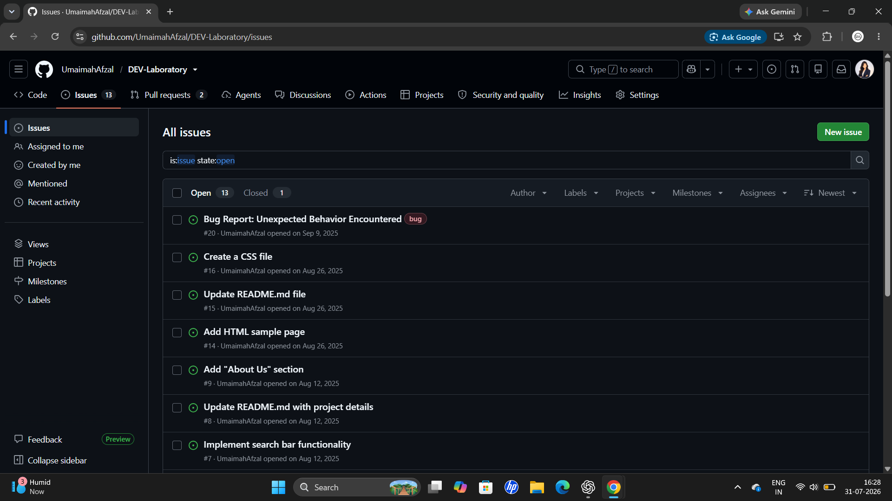
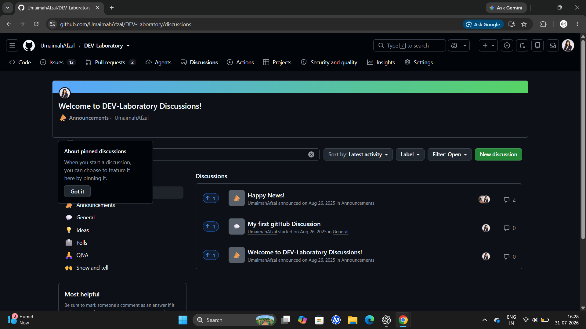
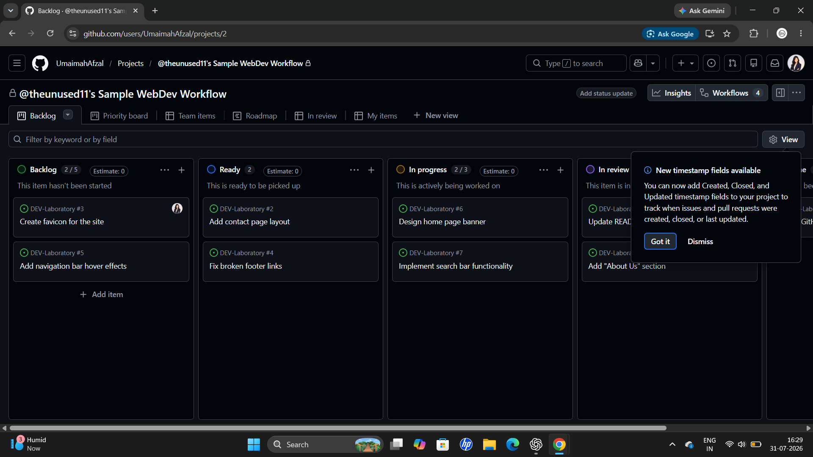

# 🚀 DEV-Laboratory

Git & GitHub laboratory repository documenting practical exercises completed during my B.Tech CSE DevOps coursework.

---

## 🎯 Objectives

- Learn Git version control
- Understand GitHub collaboration
- Practice repository management
- Explore GitHub Actions
- Work with branches and pull requests

---

## 🛠️ GitHub Features Practiced

- ✅ Repository Creation
- ✅ Git Branching
- ✅ Merging
- ✅ Pull Requests
- ✅ Issues
- ✅ GitHub Discussions
- ✅ GitHub Projects (Kanban Board)
- ✅ GitHub Actions (Basic CI Workflow)

---

## 📂 Repository Structure

```text
DEV-Laboratory
│
├── .github/
│   └── workflows/
│       └── blank.yml
│
├── Screenshots-/
│   ├── Discussions.png
│   ├── Issues.png
│   ├── Project-Board.png
│   └── Pull Requests.png
│
└── README.md
```

---

## 📸 Screenshots

### GitHub Issues


---

### Pull Requests


---

### GitHub Discussions


---

### GitHub Projects


---

## 📖 Learning Outcome

This repository helped me gain practical experience with Git and GitHub by performing hands-on laboratory exercises involving repository management, collaboration workflows, and basic CI automation using GitHub Actions.

---

## 👩‍💻 Author

**Umaimah Afzal**

B.Tech – Computer Science & Engineering
